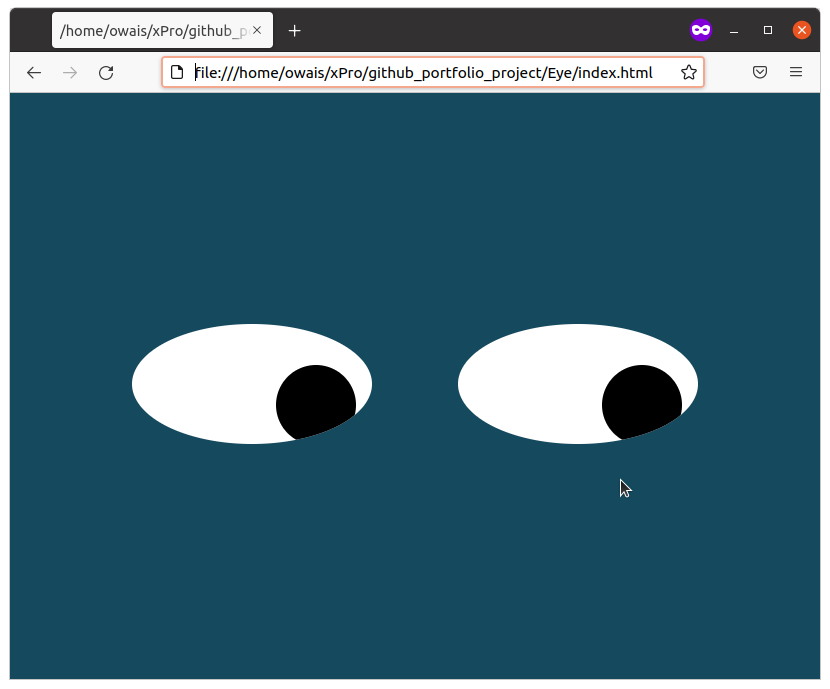

# Eye
Eye Exercise Repository for xPro course

Description: This is an exercise in using the mouse movement event to move shapes that look like eyes. The eyes will appear to be following the mouse pointer.

Usage: Download/copy the HTML, JS, and CSS files in this repository to a local folder. Open index.html and you should see something like the following:
 

Roadmap: This exercise can be improved in the future by adding features that will center the eyes if the mouse pointer has not been moved for more than ten seconds. A more advanced version could manipulate the shapes to give the effect of eyes blinking every ten seconds or so.

License: MIT License

Copyright (c) 2022 Owais Uddin Ahmed

Permission is hereby granted, free of charge, to any person obtaining a copy
of this software and associated documentation files (the "Software"), to deal
in the Software without restriction, including without limitation the rights
to use, copy, modify, merge, publish, distribute, sublicense, and/or sell
copies of the Software, and to permit persons to whom the Software is
furnished to do so, subject to the following conditions:

The above copyright notice and this permission notice shall be included in all
copies or substantial portions of the Software.

THE SOFTWARE IS PROVIDED "AS IS", WITHOUT WARRANTY OF ANY KIND, EXPRESS OR
IMPLIED, INCLUDING BUT NOT LIMITED TO THE WARRANTIES OF MERCHANTABILITY,
FITNESS FOR A PARTICULAR PURPOSE AND NONINFRINGEMENT. IN NO EVENT SHALL THE
AUTHORS OR COPYRIGHT HOLDERS BE LIABLE FOR ANY CLAIM, DAMAGES OR OTHER
LIABILITY, WHETHER IN AN ACTION OF CONTRACT, TORT OR OTHERWISE, ARISING FROM,
OUT OF OR IN CONNECTION WITH THE SOFTWARE OR THE USE OR OTHER DEALINGS IN THE
SOFTWARE.
